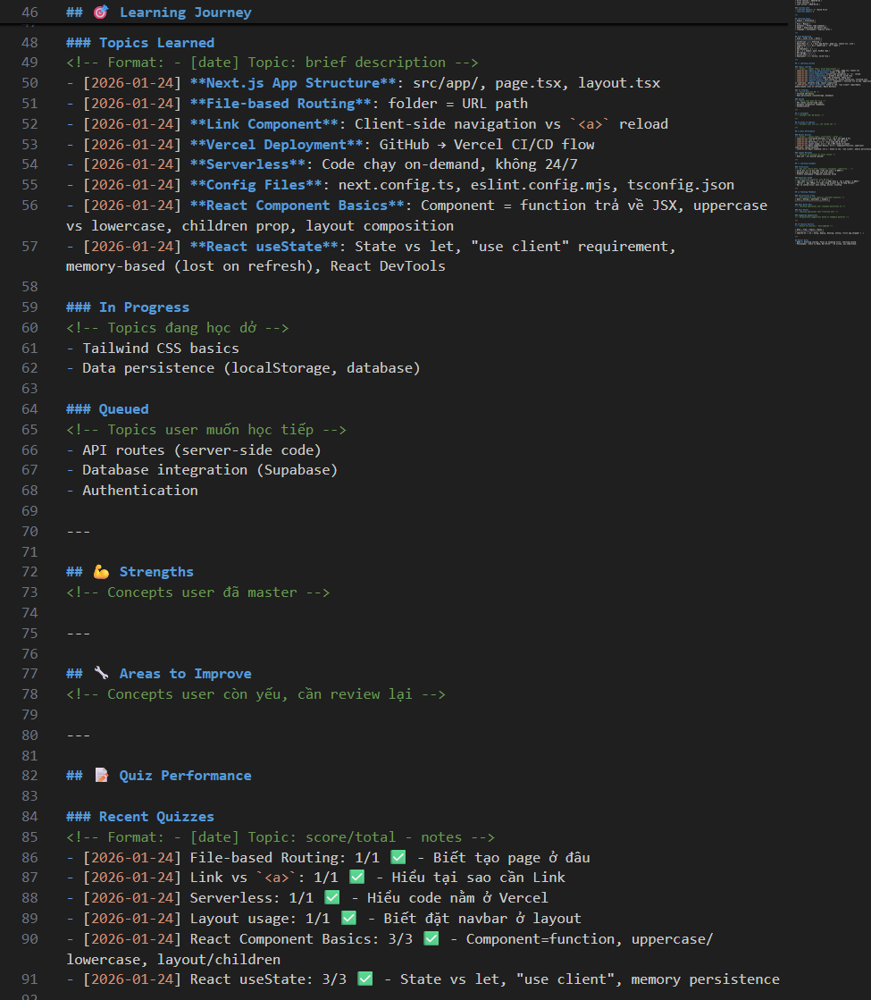

# Hooks Trong Skills: Cách Tạo Skill Tự Update Trong Claude Code

> Khi mentor AI có thể "nhớ" và adapt theo từng session với user

---

## TL;DR

## Claude Code hỗ trợ hooks trong skills - cho phép skill chạy code tự động khi events xảy ra. Mình đã dùng feature này để tạo một **mentor skill tự update learner profile** sau mỗi session, giúp AI "nhớ" tiến độ học và adapt teaching style.

## Hooks Là Gì?

Hooks trong Claude Code là các "event listeners" - chạy script khi có sự kiện cụ thể xảy ra trong session. Có 12 hook events:
| Hook | Khi Nào Chạy |
|------|--------------|
| `SessionStart` | Session bắt đầu hoặc resume |
| `UserPromptSubmit` | User submit prompt |
| `PreToolUse` | Trước khi tool chạy |
| `PostToolUse` | Sau khi tool chạy thành công |
| `Stop` | Claude kết thúc response |
| `SessionEnd` | Session kết thúc |
| ... | và các events khác |

---

## Hooks Trong Skills vs Settings

**Settings hooks** (trong `.claude/settings.json`): Chạy globally cho toàn bộ project.
**Skill hooks** (trong `SKILL.md` frontmatter): Chạy **chỉ khi skill đó được activate**.
Đây là điểm khác biệt quan trọng - skill hooks cho phép bạn tạo behavior scoped riêng cho từng skill.

---

## Use Case: Self-Updating Mentor Skill

### Problem

Tạo AI Mentor skill mà có thể:

- Nhớ topics đã học qua các sessions
- Track teaching satisfaction từ implicit feedback
- Adapt teaching style dựa trên user preferences

### Solution Architecture

```
SKILL.md (sb skill)
    └── Stop hook
            └── swe-learning-memory.cjs
                    ├── Parse transcript
                    ├── Detect learning activity
                    ├── Analyze sentiment
                    └── Update learner-profile.md
```

## Kết Quả

Mỗi khi session với `/sb learn` kết thúc:

1. **Hook tự động chạy** - không cần user action
2. **Phân tích conversation** - detect topics, questions, quiz attempts
3. **Track sentiment** - từ implicit signals trong messages
4. **Update profile** - persistent memory cho session tiếp theo
   Lần sau user quay lại, AI đọc profile và **adapt accordingly**:

- User hay confused -> slow down, more examples
- User thích code-first -> skip theory, show code ngay
- User đã master topic X -> không repeat basics

---

## Conclusion

Hooks trong skills mở ra khả năng tạo **stateful AI experiences**:

- Mentor skills nhớ progress
- Code review skills track patterns
- Project management skills accumulate context
  Thay vì AI "quên sạch" mỗi session, hooks giúp tạo **persistent memory** cho các use cases phức tạp.

---

## References

- [Claude Code Hooks Reference]
  https://code.claude.com/docs/en/hooks
  #ClaudeCode #hooks #claudeskills #AIMemory #learningmentor


