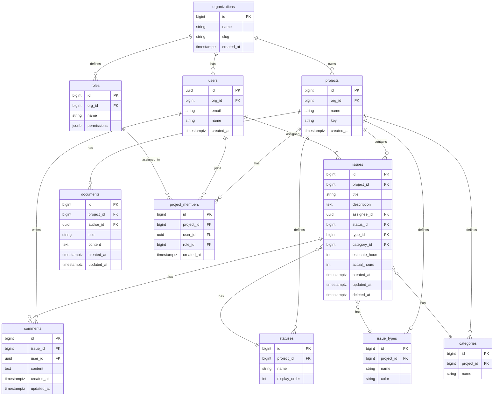

# Backlog Clone - ER Diagram

## Entity Relationship Diagram

## Summary

| Type | Tables |
|------|--------|
| Entity | organizations, profiles, projects, issues, documents, comments |
| Junction | project_members, issue_categories |
| Lookup | roles, statuses, issue_types, categories |
| **Total** | **13 tables** |

## Implementation Plan

See: `plans/260125-1822-backlog-clone-mvp/`
